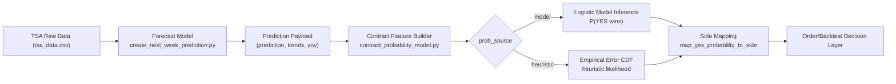
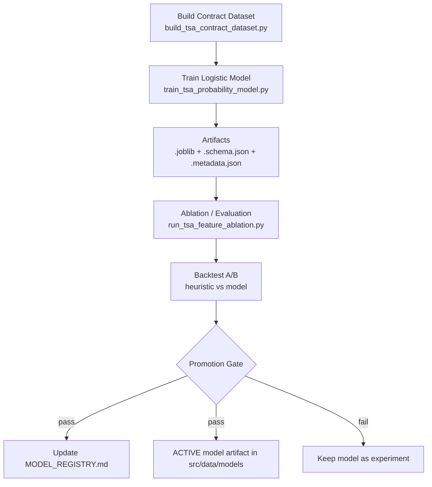
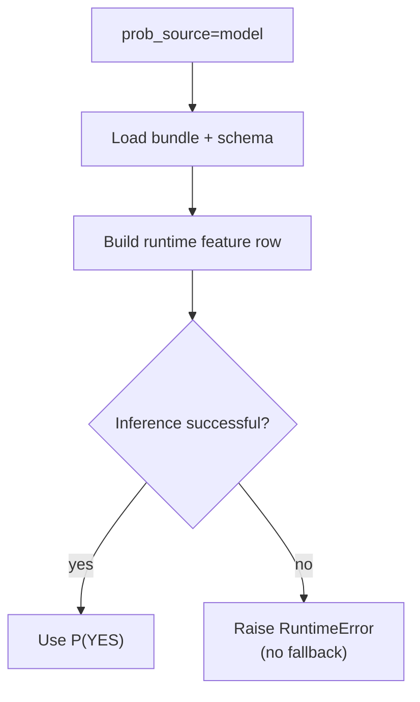
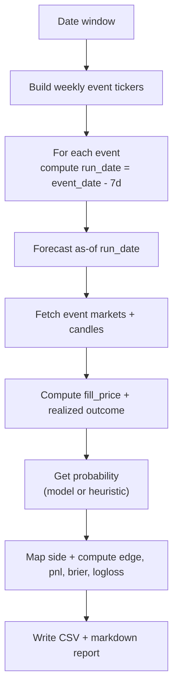
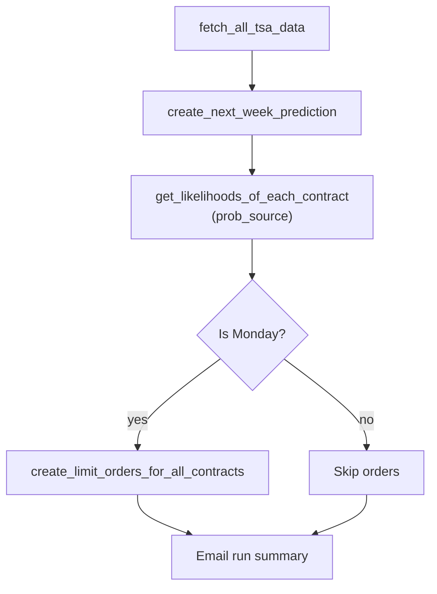

# TSA Flow Diagrams

These diagrams explain the end-to-end TSA workflow at a glance.

## 1) High-Level TSA System Flow

## 2) Model Training + Promotion Flow

## 3) Strict Model-Mode Runtime Behavior

## 4) Backtest Execution Flow

## 5) Live TSA Trading Bot Flow

